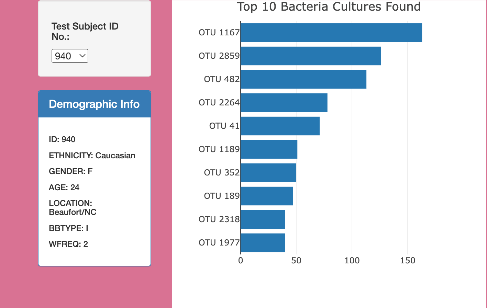
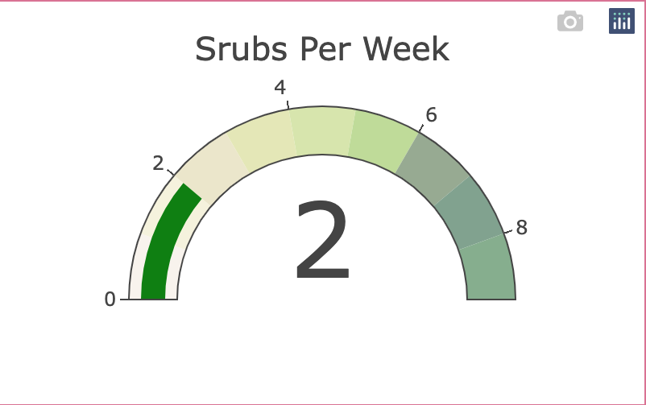

# Bacteria_to_Beef
## Purpose 
The purpose of this challenge was to identify the top 10 bacterial species in the belly buttons of each volunteer. We first made a drop down nemu showing the demographic infomration of the person based on their number. 

## Deliverable 1 (Creating the Bar Chart)
As part of Deliverable 1, I made a bar graph showing the top 10 bacterial species (an OTU) for each person when we selected a volunteer's number. 

### Bar Chart 

## Deliverable 2 (Creating the Bubble Chart)
To compliment the Bar Chart, a bubble chart was also created to compliment the bar chart. The bubble chart's purpose is to display the Bacteria Cultures Per Sample when a volunteer's id is selected.

### Bubble Chart 

## Deliverable 3 (Creating the Gauge Chart)
For Deliverable 3, I was tasked to create a gauge chart that displayes the weekly washing frequency, and display the value as a measure from 0-10 on the progress bar. The bar chart would update based on the volunteer that was selected from the drop down. The gauge would compliment both the bar and bubble chart.

### Gauge Chart

## Deliverable 4 (Custom Webpage)
In order to better the webpage. I have made the following custom additions.
- Added an Image to the jumbotron.

- Downloaded a Custom Font as well as changed the Font folor in order for the letters to be seen withh the image in the background.

- Changed the background of the webpage in order to match the image of the jumbotron.

- Changed the sizes of the gauge and bubble chart.

# Resources
- Javascript

- Plotly

- VS Code

- HTML

- daFont.com
